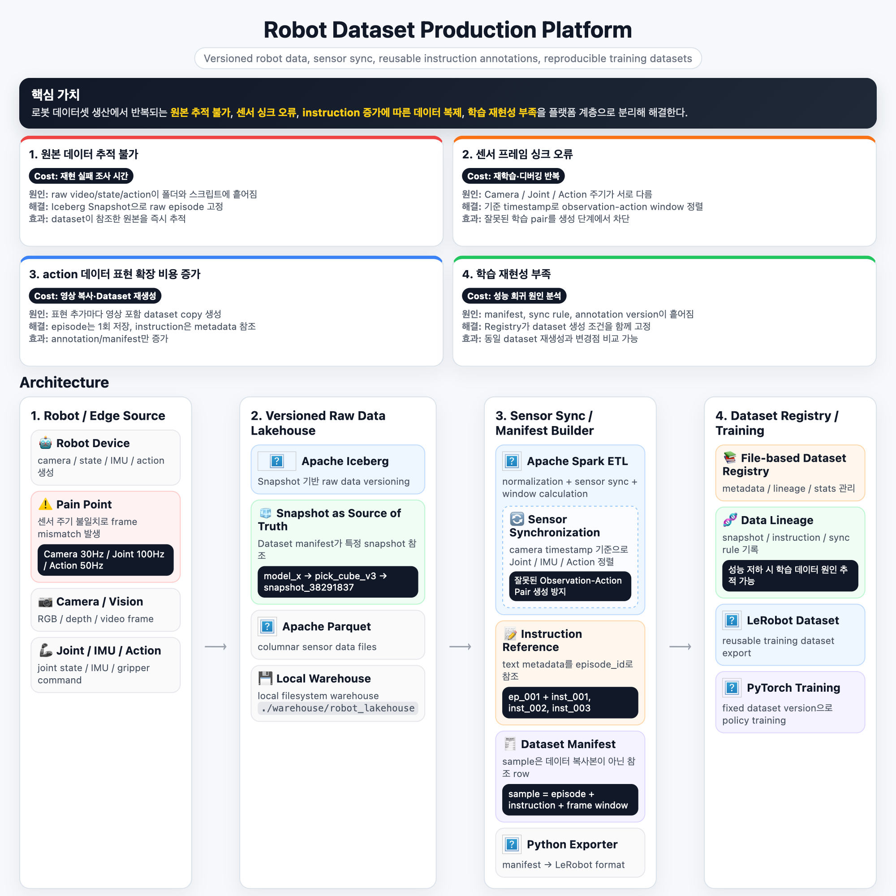

# Robot Dataset Production Platform

로봇 학습 데이터셋을 생산하기 위한 로컬 데이터 플랫폼이다. 핵심 목표는 원본 로봇 episode를 한 번만 저장하고, 센서 싱크, instruction annotation, manifest, registry, LeRobot export를 분리해서 재현 가능한 학습 데이터셋을 만드는 것이다.

## 아키텍처 다이어그램



HTML 버전은 아래 파일에서 확인할 수 있다.

```text
docs/architecture.html
```

플랫폼은 크게 네 계층으로 구성된다.

```text
Robot / Edge Source
  -> Versioned Raw Data Lakehouse
  -> Spark Sensor Sync / Manifest Builder
  -> Dataset Registry / Training
```

이 구조가 해결하려는 병목은 다음과 같다.

- 원본 데이터가 어떤 학습 데이터셋에 쓰였는지 추적하기 어려움
- 카메라, 관절 상태, 액션 stream의 timestamp/frame sync가 맞지 않음
- instruction 표현을 늘릴 때 영상 포함 데이터셋을 반복 생성하게 됨
- dataset version, sync rule, annotation policy가 흩어져 학습 재현이 어려움

## 핵심 아이디어

원본 로봇 데이터는 immutable episode로 한 번만 저장한다. 학습 데이터셋은 실제 파일 복사본이 아니라 manifest 기반 logical view로 만든다.

```text
sample = episode + instruction + frame window
```

따라서 instruction 표현, sync rule, dataset version이 바뀌어도 큰 video/sensor 파일을 다시 복사하지 않는다. 증가하는 것은 annotation row와 manifest metadata뿐이다.

## 프로젝트 구조

```text
configs/                         # Lakehouse, sync, manifest, export 설정
warehouse/robot_lakehouse/        # 로컬 Iceberg warehouse
data/raw/episodes/                # 원본 robot episode 파일 위치
data/annotations/                 # 언어 instruction 및 label metadata
data/manifests/                   # Dataset manifest JSONL/Parquet 산출물
data/exports/lerobot/             # LeRobot 스타일 export 산출물
registry/datasets/                # Dataset metadata, lineage, stats, version 기록
src/robot_dataset_platform/       # 플랫폼 공통 모듈
jobs/                             # 단계별 실행 job
jobs/snapshot/                    # HuggingFace snapshot 다운로드/검사
jobs/lakehouse/                   # Raw parquet -> Iceberg 적재
jobs/sync/                        # Sensor sync 및 observation/action window 생성
jobs/annotations/                 # Instruction annotation metadata 생성/검사
jobs/manifest/                    # Logical dataset manifest 생성/검증/resolve
jobs/export/                      # LeRobot 스타일 export 및 검증
jobs/pipeline/                    # Robotis MVP end-to-end runner
tests/                            # 테스트 및 fixture
notebooks/                        # 데이터셋 분석 notebook
```

## MVP 흐름

```text
Raw Episode
  -> Versioned Lakehouse Snapshot
  -> Spark Sensor Sync / Window Builder
  -> Instruction Annotation Layer
  -> Dataset Manifest
  -> Dataset Registry
  -> LeRobot Export
```

## Docker Compose 실행

로컬 MVP는 Docker Compose로 실행한다. Spark, Java, Python 의존성을 컨테이너 안에 고정해서 로컬 환경 차이를 줄인다.

Linux 서버에서는 bind mount로 생성되는 파일 권한 문제를 줄이기 위해 host uid/gid로 컨테이너를 실행한다.

```bash
cp .env.example .env
sed -i "s/HOST_UID=.*/HOST_UID=$(id -u)/" .env
sed -i "s/HOST_GID=.*/HOST_GID=$(id -g)/" .env
```

기존 컨테이너가 다른 사용자 권한으로 artifact를 만들었다면 먼저 권한을 정리한다.

```bash
sudo chown -R $(id -u):$(id -g) .cache data warehouse registry 2>/dev/null || true
mkdir -p .cache data warehouse registry
```

Spark/Hadoop job은 Docker Compose 환경변수로 `HADOOP_USER_NAME=spark`, `-Duser.name=spark`를 사용한다. 이렇게 해야 컨테이너가 host UID로 실행되어도 Hadoop user lookup 문제가 나지 않는다.

환경을 빌드한다.

```bash
docker compose build
```

Spark master/worker를 실행한다.

```bash
docker compose up -d spark-master spark-worker
```

## 전체 파이프라인 실행

Robotis source snapshot이 이미 있으면 아래 명령 하나로 전체 MVP를 실행할 수 있다.

```bash
docker compose run --rm app -lc "python jobs/pipeline/run_robotis_mvp.py"
```

snapshot 다운로드까지 포함하려면 `--download`를 사용한다.

```bash
docker compose run --rm app -lc "python jobs/pipeline/run_robotis_mvp.py --download"
```

중간 inspect preview를 생략하고 조용히 재빌드하려면 `--skip-inspect`를 사용한다.

```bash
docker compose run --rm app -lc "python jobs/pipeline/run_robotis_mvp.py --skip-inspect"
```

## 단계별 실행

Robotis Pick & Place source snapshot을 다운로드한다.

```bash
docker compose run --rm app -lc "python - <<'PY'
from huggingface_hub import snapshot_download

snapshot_download(
    repo_id='RobotisSW/omy_PickAndPlace_RedBlock2',
    repo_type='dataset',
    local_dir='data/external/RobotisSW_omy_PickAndPlace_RedBlock2',
    allow_patterns=['README.md', 'meta/**', 'data/**', 'videos/**'],
)
PY"
```

다운로드 후 pipeline 실행 전에 source dataset이 플랫폼 표준 contract를 만족하는지 검증한다.

```bash
docker compose run --rm app -lc "python jobs/snapshot/validate_dataset_contract.py"
```

Contract validator는 `meta/info.json`, frame parquet, episode/task metadata, 필수 frame column, action/observation column, video path template, video reference, episode별 timestamp/frame 품질을 확인한다. 표준을 만족하지 못하면 ingest 전에 실패 지점을 알려준다.

Contract 검증을 통과하면 snapshot을 사람이 읽기 쉬운 형태로 검사할 수 있다.

```bash
docker compose run --rm app -lc "python jobs/snapshot/inspect_lerobot_snapshot.py"
```

현재 Robotis working set은 LeRobot v2.1 구조이며 규모는 다음과 같다.

```text
episodes: 100
frames: 47,761
tasks: 2
videos: 200
robot: aiworker
```

원본 LeRobot parquet를 로컬 Iceberg table로 적재한다.

```bash
docker compose run --rm app -lc "python jobs/lakehouse/ingest_raw_to_iceberg.py"
```

생성되는 Iceberg table은 다음과 같다.

```text
robot_lakehouse.raw.frames
robot_lakehouse.raw.episodes
robot_lakehouse.raw.tasks
```

Iceberg row count와 snapshot을 확인한다.

```bash
docker compose run --rm app -lc "python jobs/lakehouse/inspect_iceberg_tables.py"
```

Raw frame table에서 sensor sync sample을 생성한다.

```bash
docker compose run --rm app -lc "python jobs/sync/build_synced_samples.py"
```

생성되는 sync table은 다음과 같다.

```text
robot_lakehouse.synced.samples
```

각 row는 하나의 logical sample 후보이며 observation/action window, timestamp coverage, row-count check, source snapshot id, `sync_status`를 가진다.

Sync 결과를 확인한다.

```bash
docker compose run --rm app -lc "python jobs/sync/inspect_synced_samples.py"
```

Synced sample을 기준으로 instruction annotation table을 생성한다.

```bash
docker compose run --rm app -lc "python jobs/annotations/build_instruction_annotations.py"
```

생성되는 annotation table은 다음과 같다.

```text
robot_lakehouse.annotations.instructions
```

Annotation row는 기존 episode와 source instruction에 연결된다. Paraphrase를 추가해도 video와 raw frame parquet는 복사하지 않고 metadata row만 늘어난다.

Annotation 결과를 확인한다.

```bash
docker compose run --rm app -lc "python jobs/annotations/inspect_instruction_annotations.py"
```

Annotation이 결합된 manifest를 생성한다.

```bash
docker compose run --rm app -lc "python jobs/manifest/build_manifest_spark.py --config configs/manifest_from_synced.yaml"
```

End-to-end build artifact를 검증한다.

```bash
docker compose run --rm app -lc "python jobs/manifest/validate_dataset_build.py"
```

Validator는 다음을 확인한다.

- raw Iceberg table이 비어 있지 않고 snapshot을 가지고 있는지
- manifest에 들어가는 source row가 `sync_status = ok` 조건을 만족하는지
- manifest row count가 annotation-expanded source view와 일치하는지
- sample id가 unique한지
- frame window가 유효한지
- registry의 hash/snapshot id가 실제 artifact와 일치하는지

Manifest 한 줄이 실제 source episode window로 resolve되는지 확인한다.

```bash
docker compose run --rm app -lc "python jobs/manifest/resolve_manifest_sample.py"
```

이 단계는 manifest가 복사된 데이터셋이 아니라 logical index임을 보여준다. 한 manifest row는 다음 정보로 resolve된다.

```text
instruction text
episode id
observation frame window
action frame window
episode video references
```

Annotation-aware manifest를 LeRobot 스타일 tabular dataset으로 export한다.

```bash
docker compose run --rm app -lc "python jobs/export/export_lerobot_manifest.py"
```

Export는 manifest row마다 하나의 logical training sample을 materialize한다. Observation/action tabular 값은 export parquet로 만들고, 큰 source video는 복사하지 않고 `meta/sample_refs.jsonl`에 참조로 남긴다. Manifest, annotation, sync, source snapshot lineage는 export metadata와 dataset registry에 함께 기록한다.

```text
data/exports/lerobot/robotis_omy_pick_place_redblock_synced_export/
  meta/info.json
  meta/stats.json
  meta/export_lineage.json
  meta/validation_report.json
  meta/tasks.parquet
  meta/episodes/chunk-000/file-000.parquet
  meta/sample_refs.jsonl
  data/chunk-000/file-000.parquet
```

Export 산출물을 검증한다.

```bash
docker compose run --rm app -lc "python jobs/export/validate_lerobot_export.py"
```

Export 검증기는 manifest row 수, exported data row 수, episode row 수, sample ref 수, manifest hash, 필수 column, registry record가 모두 일치하는지 확인한다.

## 실행 결과 요약

완료된 Robotis MVP 실행 결과는 다음과 같다.

```text
raw.frames: 47,761
raw.episodes: 100
raw.tasks: 2
synced.samples: 1,534
synced ok samples: 1,508
annotations: 400
manifest rows: 6,032
export rows: 6,032
missing video refs: 0
```

## 결과 분석

Robotis Pick & Place 실행 결과는 이 플랫폼의 핵심 설계가 end-to-end로 동작한다는 것을 보여준다. Physical robot data는 고정하고, sensor sync window, instruction annotation, manifest, export metadata를 조합해 logical training dataset을 만든다.

```text
100 physical episodes
  -> 1,534 synced temporal samples
  -> 1,508 valid training windows
  -> 400 instruction annotations
  -> 6,032 logical manifest rows
  -> 6,032 LeRobot-style export rows
```

47,761개의 raw frame row는 Iceberg `raw.frames`에 한 번만 저장된다. Episode metadata와 task metadata는 각각 `raw.episodes`, `raw.tasks`로 분리되어 저장되고, 각 Iceberg snapshot id는 registry에 기록된다. 이후 dataset version은 폴더명이나 수동 메모가 아니라 정확한 table snapshot을 참조할 수 있다.

Sync 단계에서는 1,534개의 candidate window가 생성됐다. 이 중 1,508개는 `sync_status = ok`를 통과했고, 26개는 `missing_window_rows`로 표시됐다. 이 26개 row는 manifest에 들어가지 않지만 sync table에는 품질 증거로 남는다. 즉 문제 있는 edge window를 숨기지 않고 추적 가능하게 유지하면서, 학습 export에는 정상 window만 포함한다.

Annotation Layer는 각 source instruction을 네 개의 instruction record로 확장한다. 구성은 원본 `source_task` 1개와 curated `paraphrase` 3개다. 이 row들은 `episode_id`, `source_instruction_id`로 원본 episode에 연결되는 metadata이므로 video와 raw frame parquet를 복사하지 않는다.

```text
1,508 valid synced samples x 4 active annotations = 6,032 logical samples
```

LeRobot 스타일 export는 tabular training row만 materialize하고, 큰 source video는 `meta/sample_refs.jsonl`에 참조로 남긴다. Export 검증기는 모든 일관성 검사를 통과했다. Manifest row 수와 exported data row 수가 일치하고, sample ref도 data row와 일치하며, sample id는 unique하고, registry lineage hash도 맞고, `missing_video_ref_count`는 0이다.

실질적인 결과는 instruction 표현을 늘려도 물리 데이터 크기가 영상 단위로 늘어나지 않는다는 점이다. 이번 실행에서는 100개의 source episode와 200개의 source video를 복사하지 않고도 6,032개의 training row를 만들었다. 증가한 것은 작은 annotation/manifest/export metadata다.

## 주요 산출물

Manifest는 JSONL과 Snappy-compressed Parquet로 저장된다.

```text
data/manifests/robotis_omy_pick_place_redblock_synced/manifest.jsonl
data/manifests/robotis_omy_pick_place_redblock_synced/manifest.parquet/
```

Manifest registry는 content-derived version과 lineage를 기록한다.

```text
registry/datasets/robotis_omy_pick_place_redblock_synced/metadata.json
registry/datasets/robotis_omy_pick_place_redblock_synced/lineage.json
registry/datasets/robotis_omy_pick_place_redblock_synced/stats.json
registry/datasets/robotis_omy_pick_place_redblock_synced/validation_report.json
```

Annotation Layer가 활성화되면 하나의 physical episode window가 여러 logical sample로 확장된다.

```text
sample = source_sample + annotation instruction
```

예를 들어 하나의 synced window는 source instruction과 paraphrase마다 별도의 manifest row가 된다. 하지만 모든 row는 같은 episode, 같은 frame window, 같은 Iceberg snapshot을 참조한다.

## Git 제외 대상

생성 데이터와 큰 artifact는 Git에 올리지 않는다.

```text
data/
warehouse/
registry/datasets/
registry/annotations/
.cache/
```

## 주요 컴포넌트

- `lakehouse`: raw episode table, Iceberg snapshot, time travel metadata
- `sync`: timestamp alignment, observation/action window 생성
- `annotations`: instruction, paraphrase, task/object/scene label metadata
- `manifest`: raw data 복사 없는 sample index 생성
- `manifest/resolver`: manifest row를 source episode/frame window/video ref로 resolve
- `registry`: dataset version, lineage, stats, reproducibility record
- `export`: manifest 기반 LeRobot/HuggingFace 스타일 dataset export
